# C4 Context Diagram - TextDigest System

```mermaid
graph TB
    User["👤 User<br/>(Developer, Analyst)"]
    TextDigest["📦 TextDigest System<br/><br/>Intelligent Text File Digest Generator<br/>Summarizes recent text files with<br/>LLM-powered insights, law filtering,<br/>and advanced fact analysis"]
    Gemini["🤖 Google Gemini API<br/><br/>Primary LLM for summarization"]
    OpenAI["🤖 OpenAI GPT API<br/><br/>Fallback LLM for reliability"]
    FileSystem["💾 File System<br/><br/>Source text files<br/>(.txt, .md, .log)"]
    
    User -->|"Configures:<br/>--folder, --days,<br/>--include-conclusions,<br/>--exclude-law"| TextDigest
    TextDigest -->|"Returns:<br/>digest.md with<br/>insights, facts,<br/>conclusions"| User
    TextDigest -->|"Reads files modified<br/>in last N days"| FileSystem
    TextDigest -->|"Sends batches<br/>for summarization"| Gemini
    TextDigest -->|"Fallback if<br/>primary fails"| OpenAI
    Gemini -->|"Returns summaries,<br/>facts, insights"| TextDigest
    OpenAI -->|"Returns summaries<br/>(fallback)"| TextDigest
    
    style TextDigest fill:#4A90E2,stroke:#333,stroke-width:3px,color:#fff
    style User fill:#50E3C2,stroke:#333,stroke-width:2px,color:#000
    style Gemini fill:#F5A623,stroke:#333,stroke-width:2px,color:#000
    style OpenAI fill:#F5A623,stroke:#333,stroke-width:2px,color:#000
    style FileSystem fill:#B8E986,stroke:#333,stroke-width:2px,color:#000
```

## System Purpose

**TextDigest** automatically discovers, reads, and summarizes recent text files from a specified directory, generating a comprehensive digest with:
- Executive summary of key insights
- Advanced fact analysis (common, unusual, long facts)
- LLM-generated conclusions and recommendations
- Complete source traceability

## Key Users

- **Developers**: Reviewing recent code changes, logs, and documentation
- **Analysts**: Extracting insights from text data collections
- **Teams**: Understanding recent project activity

## External Dependencies

1. **Google Gemini API** (Primary)
   - Model: gemini-2.0-flash-exp
   - Purpose: Batch summarization with source linking
   - Fallback: OpenAI if unavailable

2. **OpenAI GPT API** (Fallback)
   - Model: gpt-4o-mini
   - Purpose: Backup summarization provider
   - Reliability: High availability

3. **File System**
   - Input: Text files (.txt, .md, .log)
   - Filter: Modified in last N days (configurable)
   - Output: digest.md markdown file
