# C4 Container Diagram - TextDigest Architecture

```mermaid
graph TB
    User["👤 User"]
    
    subgraph TextDigest["TextDigest System"]
        CLI["🖥️ CLI Interface<br/><br/>Commander.js<br/>Argument parsing,<br/>orchestration"]
        FileDiscovery["📁 File Discovery<br/><br/>Glob patterns<br/>Date filtering"]
        ContentProcessor["⚙️ Content Processor<br/><br/>Batch creation<br/>Parallel processing"]
        ContentFilter["⚖️ Content Filter<br/>v2.1<br/>Law content detection"]
        LLMSummarizer["🤖 LLM Summarizer<br/><br/>Gemini/OpenAI<br/>Conclusions generator"]
        FactAnalyzer["🔍 Fact Analyzer<br/>v2.1<br/>TF-IDF, frequency"]
        GraphBuilder["🧠 Graph Builder<br/>v2.1<br/>Entity extraction"]
        DigestBuilder["📝 Digest Builder<br/><br/>Markdown generation"]
        Evaluator["✅ Evaluator<br/><br/>Quality metrics"]
    end
    
    Gemini["🤖 Google Gemini"]
    OpenAI["🤖 OpenAI GPT"]
    FileSystem["💾 File System"]
    
    User -->|"CLI commands"| CLI
    CLI --> FileDiscovery
    FileDiscovery -->|"FileMetadata[]"| ContentProcessor
    ContentProcessor -->|"FileContent[]"| ContentFilter
    ContentFilter -->|"Filtered files"| ContentProcessor
    ContentProcessor -->|"Batches"| LLMSummarizer
    ContentProcessor -.->|"Large batches<br/>(>50 files)"| GraphBuilder
    LLMSummarizer -->|"FileSummary[]"| FactAnalyzer
    LLMSummarizer -->|"Summaries"| DigestBuilder
    FactAnalyzer -->|"Analyzed facts"| LLMSummarizer
    FactAnalyzer -->|"Fact analysis"| DigestBuilder
    GraphBuilder -->|"Knowledge graph"| FactAnalyzer
    DigestBuilder -->|"Digest"| Evaluator
    Evaluator -->|"Quality report"| CLI
    CLI -->|"digest.md"| User
    
    FileDiscovery <-->|"Scan, read"| FileSystem
    DigestBuilder -->|"Write output"| FileSystem
    LLMSummarizer <-->|"API calls"| Gemini
    LLMSummarizer <-->|"Fallback"| OpenAI
    
    style TextDigest fill:#E8F4F8,stroke:#4A90E2,stroke-width:3px
    style CLI fill:#4A90E2,stroke:#333,stroke-width:2px,color:#fff
    style ContentFilter fill:#9B59B6,stroke:#333,stroke-width:2px,color:#fff
    style FactAnalyzer fill:#9B59B6,stroke:#333,stroke-width:2px,color:#fff
    style GraphBuilder fill:#9B59B6,stroke:#333,stroke-width:2px,color:#fff
```

## Containers Overview

### CLI Interface (cli.ts)
- **Technology**: Node.js, Commander.js
- **Purpose**: Parse arguments, orchestrate workflow
- **Key Flows**: Main entry point, error handling

### File Discovery (file-discovery.ts)
- **Technology**: glob library
- **Purpose**: Find text files by date filter
- **Output**: FileMetadata array

### Content Processor (content-processor.ts)
- **Technology**: Node.js streams, async/await
- **Purpose**: Read files, create batches, parallel processing
- **Features**: UTF-8/latin1 encoding, max 3 concurrent batches

### Content Filter (content-filter.ts) [v2.1]
- **Technology**: Regex patterns, natural language
- **Purpose**: Detect and filter law content
- **Accuracy**: 90% precision, 85% recall target

### LLM Summarizer (llm-summarizer.ts)
- **Technology**: Google Gemini SDK, OpenAI SDK
- **Purpose**: Generate summaries, facts, insights, conclusions
- **Features**: Automatic fallback, confidence scoring

### Fact Analyzer (fact-analyzer.ts) [v2.1]
- **Technology**: natural (TF-IDF)
- **Purpose**: Analyze common, unusual, and long facts
- **Output**: Categorized facts with sources

### Graph Builder (graph-builder.ts) [v2.1]
- **Technology**: compromise (NLP), ml-kmeans
- **Purpose**: Build knowledge graph for large batches
- **Trigger**: >50 files or >20K tokens

### Digest Builder (digest-builder.ts)
- **Technology**: Markdown generation
- **Purpose**: Create final digest.md output
- **Sections**: Executive summary, facts, conclusions, statistics

### Evaluator (evaluator.ts)
- **Technology**: Custom metrics
- **Purpose**: Quality gate evaluation
- **Thresholds**: 90% source linking, 80% coverage, 75% confidence
