# C4 Component Diagram - Core Processing Flow

```mermaid
graph TB
    subgraph CLI["CLI Interface"]
        ArgParser["Argument Parser"]
        Orchestrator["Main Orchestrator"]
        ErrorHandler["Error Handler"]
    end
    
    subgraph Discovery["File Discovery Module"]
        Scanner["File Scanner<br/>(glob)"]
        DateFilter["Date Filter"]
        TypeFilter["Type Filter<br/>(.txt, .md, .log)"]
    end
    
    subgraph Processing["Content Processing Module"]
        FileReader["File Reader<br/>(UTF-8/latin1)"]
        BatchCreator["Batch Creator<br/>(20 files/batch)"]
        ParallelExecutor["Parallel Executor<br/>(max 3 concurrent)"]
    end
    
    subgraph Filtering["Content Filtering Module v2.1"]
        LegalTermsMatcher["Legal Terms Matcher"]
        CitationDetector["Case Citation Detector"]
        StatuteDetector["Statute Detector"]
        ConfidenceCalculator["Confidence Calculator"]
    end
    
    subgraph LLM["LLM Summarizer Module"]
        PromptBuilder["Prompt Builder"]
        GeminiClient["Gemini Client"]
        OpenAIClient["OpenAI Client"]
        ResponseParser["Response Parser"]
        ConclusionsGenerator["Conclusions Generator v2.1"]
    end
    
    subgraph FactAnalysis["Fact Analysis Module v2.1"]
        FrequencyAnalyzer["Frequency Analyzer"]
        TFIDFCalculator["TF-IDF Calculator"]
        LengthAnalyzer["Length Analyzer<br/>(>50 words)"]
        FactCategorizer["Fact Categorizer"]
    end
    
    subgraph KnowledgeGraph["Knowledge Graph Module v2.1"]
        EntityExtractor["Entity Extractor<br/>(compromise)"]
        ClusterAnalyzer["Cluster Analyzer<br/>(k-means)"]
        RelationshipMapper["Relationship Mapper"]
    end
    
    subgraph DigestGen["Digest Generation Module"]
        MarkdownBuilder["Markdown Builder"]
        StatisticsCalculator["Statistics Calculator"]
        SourceIndexer["Source Indexer"]
    end
    
    ArgParser --> Orchestrator
    Orchestrator --> Scanner
    Scanner --> DateFilter
    DateFilter --> TypeFilter
    TypeFilter --> FileReader
    FileReader --> BatchCreator
    BatchCreator --> LegalTermsMatcher
    LegalTermsMatcher --> CitationDetector
    CitationDetector --> StatuteDetector
    StatuteDetector --> ConfidenceCalculator
    ConfidenceCalculator --> ParallelExecutor
    ParallelExecutor --> PromptBuilder
    PromptBuilder --> GeminiClient
    GeminiClient -.->|"fallback"| OpenAIClient
    GeminiClient --> ResponseParser
    OpenAIClient --> ResponseParser
    ResponseParser --> FrequencyAnalyzer
    ResponseParser -.->|">50 files"| EntityExtractor
    FrequencyAnalyzer --> TFIDFCalculator
    TFIDFCalculator --> LengthAnalyzer
    LengthAnalyzer --> FactCategorizer
    FactCategorizer --> ConclusionsGenerator
    EntityExtractor --> ClusterAnalyzer
    ClusterAnalyzer --> RelationshipMapper
    RelationshipMapper --> ConclusionsGenerator
    ConclusionsGenerator --> MarkdownBuilder
    MarkdownBuilder --> StatisticsCalculator
    StatisticsCalculator --> SourceIndexer
    SourceIndexer --> Orchestrator
    Orchestrator --> ErrorHandler
    
    style CLI fill:#4A90E2,stroke:#333,stroke-width:2px,color:#fff
    style Discovery fill:#50E3C2,stroke:#333,stroke-width:2px
    style Processing fill:#F5A623,stroke:#333,stroke-width:2px
    style Filtering fill:#9B59B6,stroke:#333,stroke-width:2px,color:#fff
    style LLM fill:#E74C3C,stroke:#333,stroke-width:2px,color:#fff
    style FactAnalysis fill:#9B59B6,stroke:#333,stroke-width:2px,color:#fff
    style KnowledgeGraph fill:#16A085,stroke:#333,stroke-width:2px,color:#fff
    style DigestGen fill:#F39C12,stroke:#333,stroke-width:2px
```

## Component Details

### CLI Interface Components
1. **Argument Parser**: Validates and parses CLI flags
2. **Main Orchestrator**: Coordinates all processing stages
3. **Error Handler**: Graceful error handling and reporting

### File Discovery Components
1. **File Scanner**: Recursive directory traversal with glob
2. **Date Filter**: Filters files by modification date
3. **Type Filter**: Accepts only .txt, .md, .log files

### Content Processing Components
1. **File Reader**: Reads file content with encoding detection
2. **Batch Creator**: Groups files into batches of 20
3. **Parallel Executor**: Processes up to 3 batches concurrently

### Content Filtering Components [v2.1]
1. **Legal Terms Matcher**: Pattern matching for legal terminology
2. **Case Citation Detector**: Identifies case citations (e.g., "Brown v. Board")
3. **Statute Detector**: Identifies statutes (e.g., "18 U.S.C. § 1001")
4. **Confidence Calculator**: Calculates filtering confidence score

### LLM Summarizer Components
1. **Prompt Builder**: Constructs batch summarization prompts
2. **Gemini Client**: Primary LLM API integration
3. **OpenAI Client**: Fallback LLM API integration
4. **Response Parser**: Parses JSON responses
5. **Conclusions Generator** [v2.1]: Generates strategic conclusions

### Fact Analysis Components [v2.1]
1. **Frequency Analyzer**: Counts fact occurrences
2. **TF-IDF Calculator**: Calculates rarity scores
3. **Length Analyzer**: Identifies facts >50 words
4. **Fact Categorizer**: Categorizes as common/unusual/long

### Knowledge Graph Components [v2.1]
1. **Entity Extractor**: NLP-based entity extraction
2. **Cluster Analyzer**: K-means clustering of entities
3. **Relationship Mapper**: Maps entity co-occurrences

### Digest Generation Components
1. **Markdown Builder**: Generates final markdown output
2. **Statistics Calculator**: Computes file statistics
3. **Source Indexer**: Creates clickable source links

## Data Flow

1. **Input**: CLI arguments → File discovery
2. **Processing**: File reading → Law filtering → Batch creation
3. **Analysis**: LLM summarization → Fact analysis → (Optional) Knowledge graph
4. **Output**: Digest generation → Quality evaluation → digest.md
