# Sequence Diagram - TextDigest Processing Flow

```mermaid
sequenceDiagram
    actor User
    participant CLI
    participant FileDiscovery
    participant ContentProcessor
    participant ContentFilter
    participant GraphBuilder
    participant LLMSummarizer
    participant FactAnalyzer
    participant DigestBuilder
    participant Evaluator
    participant LLM as Gemini/OpenAI
    
    User->>CLI: textdigest --folder ./data --include-conclusions
    
    rect rgb(200, 230, 255)
        Note over CLI,FileDiscovery: Stage 1: File Discovery
        CLI->>FileDiscovery: discoverFiles(folder, days=6)
        FileDiscovery->>FileDiscovery: Scan directory recursively
        FileDiscovery->>FileDiscovery: Filter by date & type
        FileDiscovery-->>CLI: FileMetadata[]
    end
    
    rect rgb(255, 230, 200)
        Note over CLI,ContentProcessor: Stage 2: Content Extraction
        CLI->>ContentProcessor: extractContents(files)
        loop For each file
            ContentProcessor->>ContentProcessor: Read file (UTF-8/latin1)
            ContentProcessor->>ContentProcessor: Count lines & words
        end
        ContentProcessor-->>CLI: FileContent[]
    end
    
    rect rgb(230, 200, 255)
        Note over CLI,ContentFilter: Stage 3: Law Content Filtering (v2.1)
        CLI->>ContentFilter: batchFilterLawContent(contents)
        loop For each file
            ContentFilter->>ContentFilter: Match legal terms
            ContentFilter->>ContentFilter: Detect citations & statutes
            ContentFilter->>ContentFilter: Calculate confidence
            alt Confidence >= 0.3
                ContentFilter->>ContentFilter: Mark as legal content
            end
        end
        ContentFilter-->>CLI: Filtered FileContent[]
    end
    
    rect rgb(200, 255, 230)
        Note over CLI,GraphBuilder: Stage 4: Adaptive Processing (v2.1)
        CLI->>CLI: Check batch size & tokens
        alt Large batch (>50 files OR >20K tokens)
            CLI->>GraphBuilder: buildKnowledgeGraph(contents)
            GraphBuilder->>GraphBuilder: Extract entities (NLP)
            GraphBuilder->>GraphBuilder: Create graph nodes & edges
            GraphBuilder->>GraphBuilder: Cluster entities (k-means)
            GraphBuilder-->>CLI: KnowledgeGraph
        end
    end
    
    rect rgb(255, 255, 200)
        Note over CLI,LLMSummarizer: Stage 5: Batch Processing & Summarization
        CLI->>ContentProcessor: createBatches(contents, size=20)
        ContentProcessor-->>CLI: Batch[]
        
        par Parallel Processing (max 3 concurrent)
            CLI->>LLMSummarizer: summarizeBatch(batch1)
            LLMSummarizer->>LLM: Generate summaries with prompt
            LLM-->>LLMSummarizer: JSON response
        and
            CLI->>LLMSummarizer: summarizeBatch(batch2)
            LLMSummarizer->>LLM: Generate summaries
            LLM-->>LLMSummarizer: JSON response
        and
            CLI->>LLMSummarizer: summarizeBatch(batch3)
            LLMSummarizer->>LLM: Generate summaries
            LLM-->>LLMSummarizer: JSON response
        end
        
        LLMSummarizer-->>CLI: FileSummary[]
    end
    
    rect rgb(255, 220, 255)
        Note over CLI,FactAnalyzer: Stage 6: Fact Analysis (v2.1)
        CLI->>FactAnalyzer: analyzeFacts(summaries)
        FactAnalyzer->>FactAnalyzer: Extract all facts
        FactAnalyzer->>FactAnalyzer: Calculate frequency
        FactAnalyzer->>FactAnalyzer: Calculate TF-IDF (rarity)
        FactAnalyzer->>FactAnalyzer: Identify long facts (>50 words)
        FactAnalyzer->>FactAnalyzer: Categorize (common/unusual/long)
        FactAnalyzer-->>CLI: { common[], unusual[], long[] }
    end
    
    rect rgb(220, 255, 220)
        Note over CLI,LLMSummarizer: Stage 7: LLM Conclusions (v2.1, optional)
        alt --include-conclusions flag
            CLI->>LLMSummarizer: generateConclusions(summaries, facts)
            LLMSummarizer->>LLMSummarizer: Build strategic prompt
            LLMSummarizer->>LLM: Generate conclusions & recommendations
            LLM-->>LLMSummarizer: JSON response
            LLMSummarizer-->>CLI: LLMConclusions
        end
    end
    
    rect rgb(230, 230, 255)
        Note over CLI,DigestBuilder: Stage 8: Digest Generation
        CLI->>DigestBuilder: generateDigest(summaries, facts, conclusions)
        DigestBuilder->>DigestBuilder: Build executive summary
        DigestBuilder->>DigestBuilder: Format fact analysis
        DigestBuilder->>DigestBuilder: Add conclusions & recommendations
        DigestBuilder->>DigestBuilder: Calculate statistics
        DigestBuilder->>DigestBuilder: Create source index
        DigestBuilder->>DigestBuilder: Render markdown
        DigestBuilder-->>CLI: Digest
        CLI->>DigestBuilder: writeDigest(digest, output)
        DigestBuilder->>DigestBuilder: Write digest.md to file
    end
    
    rect rgb(255, 240, 220)
        Note over CLI,Evaluator: Stage 9: Quality Evaluation
        CLI->>Evaluator: evaluateDigest(digest, files)
        Evaluator->>Evaluator: Calculate source linking %
        Evaluator->>Evaluator: Calculate file coverage %
        Evaluator->>Evaluator: Calculate confidence %
        Evaluator->>Evaluator: Check thresholds (90%, 80%, 75%)
        Evaluator-->>CLI: EvaluationResult
    end
    
    CLI-->>User: ✅ Success: digest.md generated
    CLI-->>User: Quality metrics report
```

## Processing Stages

### Stage 1: File Discovery
- Scans folder recursively for .txt, .md, .log files
- Filters by modification date (last N days)
- Returns file metadata array

### Stage 2: Content Extraction
- Reads each file with encoding detection (UTF-8, latin1 fallback)
- Extracts content, line count, word count
- Handles read errors gracefully

### Stage 3: Law Content Filtering [v2.1]
- Pattern matching for legal terms, case citations, statutes
- Calculates confidence score (0-1)
- Filters out files with confidence >= 0.3 (configurable)

### Stage 4: Adaptive Processing [v2.1]
- Checks batch size and estimated tokens
- Activates Knowledge Graph mode for large batches (>50 files OR >20K tokens)
- Extracts entities and builds semantic clusters

### Stage 5: Batch Processing & Summarization
- Creates batches of 20 files each
- Processes up to 3 batches in parallel
- LLM generates summaries with source links
- Automatic fallback from Gemini to OpenAI on failure

### Stage 6: Fact Analysis [v2.1]
- Frequency analysis for common facts (appears 3+ times)
- TF-IDF scoring for unusual facts (rare but significant)
- Length analysis for long facts (>50 words)
- Categorizes with source traceability

### Stage 7: LLM Conclusions [v2.1]
- Optional stage (requires --include-conclusions flag)
- Generates 3-5 strategic conclusions
- Generates 3-5 actionable recommendations
- Includes supporting evidence with sources

### Stage 8: Digest Generation
- Builds executive summary from top insights
- Formats fact analysis sections
- Adds conclusions and recommendations
- Calculates file statistics
- Creates clickable source index
- Renders final markdown

### Stage 9: Quality Evaluation
- Measures source linking percentage (target: 90%+)
- Measures file coverage in executive summary (target: 80%+)
- Measures average LLM confidence (target: 75%+)
- Reports pass/fail and recommendations

## Error Handling

- **LLM Failure**: Automatic fallback from Gemini to OpenAI
- **File Read Error**: Skip file and continue processing
- **Parse Error**: Log error and use empty summary
- **No Files Found**: Exit with clear error message
