# Deployment Diagram - TextDigest Deployment Options

```mermaid
graph TB
    subgraph Local["Local Machine Deployment"]
        subgraph NodeEnv["Node.js Environment"]
            CLI_Local["TextDigest CLI"]
            SourceFiles_Local["Source Files<br/>./data/"]
            OutputFiles_Local["Output Files<br/>./output/digest.md"]
        end
        EnvVars_Local["Environment Variables<br/>GOOGLE_API_KEY<br/>OPENAI_API_KEY"]
    end
    
    subgraph Docker["Docker Deployment"]
        subgraph Container["Docker Container<br/>(node:20-alpine)"]
            CLI_Docker["TextDigest CLI"]
            AppFiles["Application Files<br/>/app/dist/"]
        end
        subgraph Volumes["Docker Volumes"]
            DataVolume["./data → /data"]
            OutputVolume["./output → /output"]
        end
        EnvVars_Docker["Environment Variables<br/>(docker-compose.yml)"]
    end
    
    subgraph Cloud["Cloud Deployment"]
        subgraph VM["Virtual Machine / Container"]
            CLI_Cloud["TextDigest CLI"]
            CloudStorage["Cloud Storage<br/>(S3, GCS, Azure)"]
        end
        Secrets["Secrets Manager<br/>API Keys"]
        CronJob["Cron Job / Scheduler"]
    end
    
    subgraph External["External Services"]
        Gemini["Google Gemini API<br/>ai.googleapis.com"]
        OpenAI_API["OpenAI API<br/>api.openai.com"]
    end
    
    User["👤 User"]
    
    User -->|"npm start"| CLI_Local
    CLI_Local <-->|"Read"| SourceFiles_Local
    CLI_Local -->|"Write"| OutputFiles_Local
    CLI_Local -.->|"Uses"| EnvVars_Local
    
    User -->|"docker-compose up"| Container
    Container <-->|"Mount"| DataVolume
    Container -->|"Mount"| OutputVolume
    Container -.->|"Uses"| EnvVars_Docker
    
    CronJob -->|"Triggers"| CLI_Cloud
    CLI_Cloud <-->|"Read/Write"| CloudStorage
    CLI_Cloud -.->|"Fetch"| Secrets
    
    CLI_Local -->|"HTTPS"| Gemini
    CLI_Local -.->|"Fallback"| OpenAI_API
    CLI_Docker -->|"HTTPS"| Gemini
    CLI_Docker -.->|"Fallback"| OpenAI_API
    CLI_Cloud -->|"HTTPS"| Gemini
    CLI_Cloud -.->|"Fallback"| OpenAI_API
    
    style Local fill:#E8F4F8,stroke:#4A90E2,stroke-width:2px
    style Docker fill:#E8F8E8,stroke:#2ECC71,stroke-width:2px
    style Cloud fill:#FFF8E8,stroke:#F39C12,stroke-width:2px
    style External fill:#FFE8E8,stroke:#E74C3C,stroke-width:2px
    style Container fill:#27AE60,stroke:#333,stroke-width:2px,color:#fff
    style VM fill:#E67E22,stroke:#333,stroke-width:2px,color:#fff
```



## Deployment Options

### 1. Local Machine Deployment

**Prerequisites:**
- Node.js 20+
- npm or yarn
- API keys for Google Gemini and/or OpenAI

**Setup Steps:**
```bash
# Install dependencies
npm install

# Build TypeScript
npm run build

# Set environment variables
export GOOGLE_API_KEY=your_key_here
export OPENAI_API_KEY=your_key_here

# Run
npm start -- --folder ./data --days 6 --output ./output/digest.md
```

**Advantages:**
- Direct control over environment
- Easy debugging
- No containerization overhead

**Use Cases:**
- Development and testing
- Ad-hoc analysis
- Personal projects

---

### 2. Docker Deployment

**Prerequisites:**
- Docker 20+
- docker-compose 2.0+

**Setup Steps:**
```bash
# Build image
docker build -t textdigest:2.1.0 .

# Run with docker-compose
docker-compose up

# Or run directly
docker run -v ./data:/data -v ./output:/output \
  -e GOOGLE_API_KEY=your_key \
  textdigest:2.1.0 --folder /data --days 6 --output /output/digest.md
```

**Docker Configuration:**
```dockerfile
FROM node:20-alpine
WORKDIR /app
COPY package*.json ./
RUN npm ci --only=production
COPY dist ./dist
ENTRYPOINT ["node", "dist/cli.js"]
```

**docker-compose.yml:**
```yaml
version: '3.8'
services:
  textdigest:
    build: .
    environment:
      - GOOGLE_API_KEY=${GOOGLE_API_KEY}
      - OPENAI_API_KEY=${OPENAI_API_KEY}
    volumes:
      - ./data:/data
      - ./output:/output
    command: ["--folder", "/data", "--days", "6", "--output", "/output/digest.md"]
```

**Advantages:**
- Reproducible environment
- Easy deployment
- Isolated dependencies
- One-command setup

**Use Cases:**
- Production deployments
- Team environments
- CI/CD pipelines

---

### 3. Cloud Deployment

**Supported Platforms:**
- AWS (EC2, ECS, Lambda with containers)
- Google Cloud (Compute Engine, Cloud Run, Cloud Functions)
- Azure (VM, Container Instances, Functions)

**Setup Steps (AWS EC2 example):**
```bash
# SSH into EC2 instance
ssh -i key.pem ec2-user@instance-ip

# Install Docker
sudo yum install docker -y
sudo service docker start

# Pull and run
docker pull ghcr.io/abezr/textdigest:2.1.0
docker run -v /mnt/data:/data -v /mnt/output:/output \
  -e GOOGLE_API_KEY=$GOOGLE_API_KEY \
  textdigest:2.1.0 --folder /data --include-conclusions
```

**Scheduled Execution (Cron):**
```bash
# Daily digest at 8 AM
0 8 * * * docker run ... textdigest:2.1.0 --folder /data --days 1
```

**Cloud Storage Integration:**
```bash
# AWS S3
aws s3 sync /data s3://my-bucket/data/
docker run -v /data:/data ...
aws s3 cp /output/digest.md s3://my-bucket/reports/

# Google Cloud Storage
gsutil -m rsync -r /data gs://my-bucket/data/
docker run -v /data:/data ...
gsutil cp /output/digest.md gs://my-bucket/reports/
```

**Advantages:**
- Scalable compute resources
- Integrated with cloud storage
- Managed secrets
- Scheduled execution

**Use Cases:**
- Enterprise deployments
- Automated reporting
- Large-scale processing
- Multi-region deployments

---

## Environment Variables

| Variable | Required | Default | Description |
|----------|----------|---------|-------------|
| `GOOGLE_API_KEY` | Yes* | - | Google Gemini API key |
| `OPENAI_API_KEY` | No | - | OpenAI API key (fallback) |
| `GOOGLE_MODEL` | No | `gemini-2.0-flash-exp` | Gemini model name |
| `OPENAI_MODEL` | No | `gpt-4o-mini` | OpenAI model name |

*At least one of GOOGLE_API_KEY or OPENAI_API_KEY is required.

---

## Resource Requirements

### Minimum Requirements
- **CPU**: 1 core (2+ recommended for parallel processing)
- **RAM**: 512 MB (1 GB+ recommended for large batches)
- **Disk**: 100 MB for application + storage for files
- **Network**: Stable internet for LLM API calls

### Recommended for Large Batches (800+ files)
- **CPU**: 4+ cores
- **RAM**: 2 GB+
- **Disk**: SSD preferred
- **Network**: High bandwidth for parallel API calls

---

## Security Considerations

1. **API Keys**: Never commit API keys to version control
   - Use environment variables
   - Use secrets managers in production
   - Rotate keys regularly

2. **File Access**: Limit file system access
   - Use Docker volumes to restrict access
   - Apply principle of least privilege

3. **Network**: Secure API communication
   - HTTPS for all LLM API calls
   - Consider API rate limiting
   - Monitor API usage

4. **Dependencies**: Keep packages updated
   - Run `npm audit` regularly
   - Update dependencies for security patches
   - Use lock files (package-lock.json)
