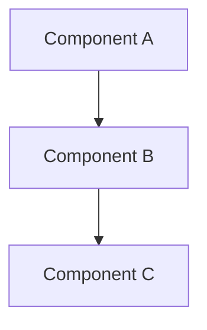

# TextDigest Architecture Diagrams

This directory contains C4 architecture diagrams for the TextDigest system, rendered using Mermaid.

## Diagram Index

### 1. [Context Diagram](01-context-diagram.md)
**System-level overview**

Shows TextDigest's position in the broader system landscape, including:
- User interactions
- External dependencies (Google Gemini, OpenAI)
- File system interactions
- High-level system purpose

**View this first** to understand what TextDigest does and how it fits into the ecosystem.

---

### 2. [Container Diagram](02-container-diagram.md)
**High-level architecture**

Breaks down TextDigest into major containers/modules:
- CLI Interface
- File Discovery
- Content Processor
- Law Content Filter (v2.1)
- LLM Summarizer
- Fact Analyzer (v2.1)
- Knowledge Graph Builder (v2.1)
- Digest Builder
- Evaluator

**View this** to understand the major building blocks and their interactions.

---

### 3. [Component Diagram](03-component-diagram.md)
**Internal component structure**

Details the internal components within each module:
- Argument parsing and orchestration
- File scanning and filtering
- Batch creation and parallel processing
- Legal term matching and confidence calculation
- LLM client integration
- Fact analysis (frequency, TF-IDF, length)
- Entity extraction and clustering
- Markdown generation

**View this** to understand the internal workings of each module.

---

### 4. [Sequence Diagram](04-sequence-diagram.md)
**Processing flow and interactions**

Shows the step-by-step flow of data through the system:
- 9-stage processing pipeline
- Parallel batch processing
- Adaptive Knowledge Graph mode
- Error handling and fallback strategies
- Quality evaluation workflow

**View this** to understand how data flows through TextDigest from input to output.

---

### 5. [Deployment Diagram](05-deployment-diagram.md)
**Deployment options and configurations**

Documents deployment strategies:
- Local machine deployment (Node.js)
- Docker deployment (containers)
- Cloud deployment (AWS, GCP, Azure)
- Environment variables and configuration
- Resource requirements
- Security considerations

**View this** to understand how to deploy TextDigest in different environments.

---

## Architecture Levels

The diagrams follow the [C4 model](https://c4model.com/) hierarchy:

```
Level 1: Context     → Who uses the system and what external systems it interacts with
Level 2: Container   → Major building blocks and their interactions
Level 3: Component   → Internal components within each container
Level 4: Code        → Class-level details (see source code and API reference)
```

Additionally:
- **Sequence Diagrams**: Show temporal flow and interactions
- **Deployment Diagrams**: Show physical/virtual infrastructure

---

## Diagram Format

All diagrams are rendered using **Mermaid**, which is natively supported by GitHub and most modern markdown viewers.

### Viewing Diagrams

1. **GitHub**: Diagrams render automatically in the GitHub web interface
2. **VS Code**: Install the "Markdown Preview Mermaid Support" extension
3. **Other editors**: Use any Mermaid-compatible markdown viewer

### Diagram Syntax



Mermaid provides:
- ✅ Native GitHub support
- ✅ Version control friendly (text-based)
- ✅ Easy to update and maintain
- ✅ Multiple diagram types (graphs, sequences, etc.)

---

## Related Documentation

- [Architecture Guide](../architecture/ARCHITECTURE.md) - Detailed architecture documentation
- [API Reference](../api/API_REFERENCE.md) - API documentation
- [Deployment Guide](../guides/DEPLOYMENT.md) - Deployment instructions

---

## Quick Navigation

| Diagram | Focus | Use Case |
|---------|-------|----------|
| **Context** | System boundaries | Understanding system purpose |
| **Container** | Major modules | System overview |
| **Component** | Internal structure | Development and debugging |
| **Sequence** | Data flow | Understanding execution |
| **Deployment** | Infrastructure | Operations and deployment |

---

**Tip**: Start with the Context Diagram and work your way down through Container → Component → Sequence → Deployment for a complete understanding of TextDigest's architecture.
